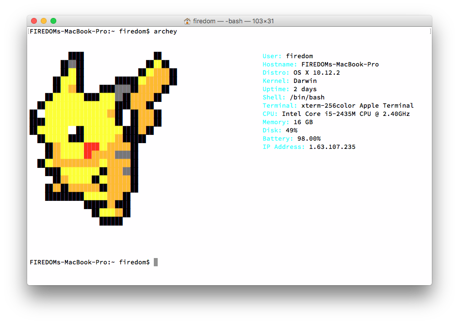
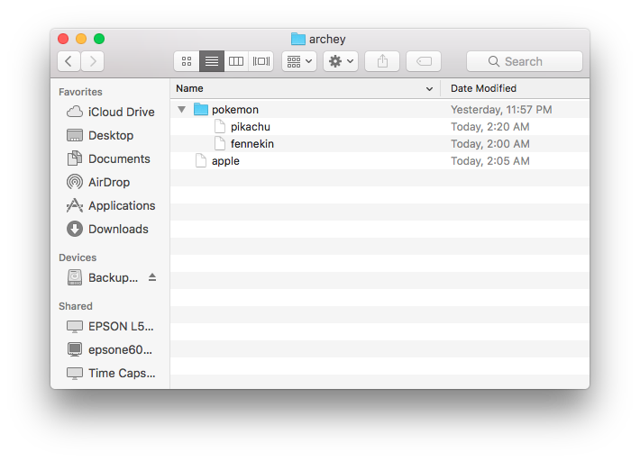
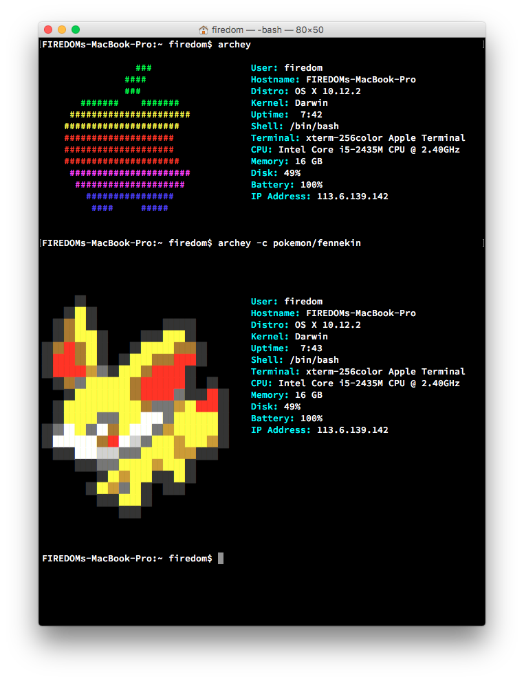
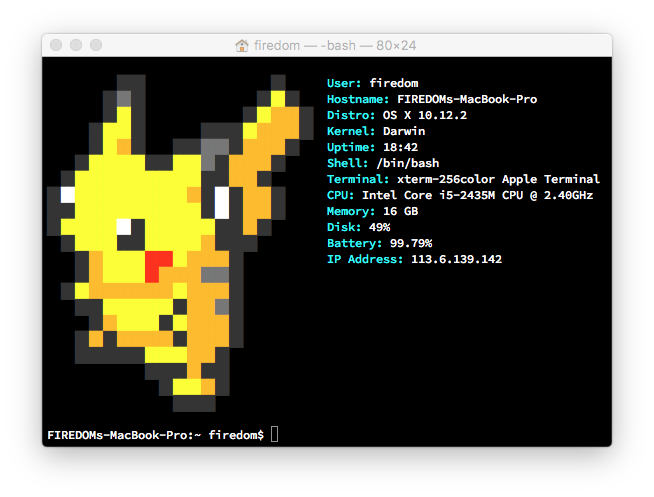

Please import Terminal Profiles(bin/archey.terminal) at first.  
One more thing is that add line `clear;archey`in `～/.bash_profile` file.


#Use costume logo
You can create a folder at `~/.config/archey`, and add your logo file like this:
  
Then you can input command `archey -c <logo filename>` disp your logo,like that:
  
#How to create costume logo  
Here is a example, if you want to get a pikachu, you may create a file `pikachu` at `~/.config/archey/pokemon`(just a example, you can named it anything and anywnere you want), and add this text to file. 
```
echo -e "
          ${P_BALCK#    }██${P_BALCK#    }██                  ${P_BALCK#    }██      ${fieldlist[0]}
        ${P_BALCK#    }██${P_GRAY#    }██${P_BALCK#    }██                ${P_BALCK#    }██${P_YELLOW#    }██${P_BALCK#    }██    ${fieldlist[1]}
        ${P_BALCK#    }██${P_YELLOW#    }██${P_BALCK#    }██              ${P_BALCK#    }██${P_YELLOW#    }██${P_ORANGE#    }██${P_ORANGE#    }██${P_BALCK#    }██  ${fieldlist[2]}
      ${P_BALCK#    }██${P_YELLOW#    }██${P_YELLOW#    }██${P_BALCK#    }██        ${P_BALCK#    }██${P_BALCK#    }██${P_BALCK#    }██${P_YELLOW#    }██${P_ORANGE#    }██${P_ORANGE#    }██${P_ORANGE#    }██${P_BALCK#    }██  ${fieldlist[3]}
      ${P_BALCK#    }██${P_YELLOW#    }██${P_ORANGE#    }██${P_BALCK#    }██    ${P_BALCK#    }██${P_BALCK#    }██${P_GRAY#    }██${P_GRAY#    }██${P_BALCK#    }██${P_ORANGE#    }██${P_ORANGE#    }██${P_ORANGE#    }██${P_BALCK#    }██    ${fieldlist[4]}
    ${P_BALCK#    }██${P_YELLOW#    }██${P_YELLOW#    }██${P_YELLOW#    }██${P_YELLOW#    }██${P_BALCK#    }██${P_BALCK#    }██${P_YELLOW#    }██${P_YELLOW#    }██${P_GRAY#    }██${P_BALCK#    }██${P_ORANGE#    }██${P_ORANGE#    }██${P_ORANGE#    }██${P_BALCK#    }██      ${fieldlist[5]}
  ${P_BALCK#    }██${P_YELLOW#    }██${P_YELLOW#    }██${P_YELLOW#    }██${P_YELLOW#    }██${P_YELLOW#    }██${P_YELLOW#    }██${P_YELLOW#    }██${P_YELLOW#    }██${P_YELLOW#    }██${P_BALCK#    }██${P_BALCK#    }██${P_ORANGE#    }██${P_ORANGE#    }██${P_BALCK#    }██        ${fieldlist[6]}
${P_BALCK#    }██${P_WRITE#    }██${P_YELLOW#    }██${P_YELLOW#    }██${P_YELLOW#    }██${P_YELLOW#    }██${P_YELLOW#    }██${P_YELLOW#    }██${P_YELLOW#    }██${P_YELLOW#    }██${P_ORANGE#    }██${P_BALCK#    }██${P_WRITE#    }██${P_BALCK#    }██${P_ORANGE#    }██${P_ORANGE#    }██${P_BALCK#    }██      ${fieldlist[7]}
${P_BALCK#    }██${P_BALCK#    }██${P_YELLOW#    }██${P_YELLOW#    }██${P_YELLOW#    }██${P_YELLOW#    }██${P_YELLOW#    }██${P_YELLOW#    }██${P_YELLOW#    }██${P_YELLOW#    }██${P_YELLOW#    }██${P_BALCK#    }██${P_WRITE#    }██${P_BALCK#    }██${P_ORANGE#    }██${P_ORANGE#    }██${P_BALCK#    }██      ${fieldlist[8]}
${P_BALCK#    }██${P_YELLOW#    }██${P_YELLOW#    }██${P_YELLOW#    }██${P_YELLOW#    }██${P_WRITE#    }██${P_BALCK#    }██${P_YELLOW#    }██${P_YELLOW#    }██${P_YELLOW#    }██${P_YELLOW#    }██${P_YELLOW#    }██${P_BALCK#    }██${P_BALCK#    }██${P_ORANGE#    }██${P_BALCK#    }██        ${fieldlist[9]}
  ${P_BALCK#    }██${P_YELLOW#    }██${P_YELLOW#    }██${P_YELLOW#    }██${P_BALCK#    }██${P_BALCK#    }██${P_YELLOW#    }██${P_YELLOW#    }██${P_YELLOW#    }██${P_YELLOW#    }██${P_ORANGE#    }██${P_BALCK#    }██${P_BALCK#    }██${P_BALCK#    }██          ${fieldlist[10]}
    ${P_BALCK#    }██${P_ORANGE#    }██${P_YELLOW#    }██${P_YELLOW#    }██${P_YELLOW#    }██${P_RED#    }██${P_RED#    }██${P_YELLOW#    }██${P_ORANGE#    }██${P_ORANGE#    }██${P_ORANGE#    }██${P_BALCK#    }██            ${fieldlist[11]}
    ${P_BALCK#    }██${P_ORANGE#    }██${P_YELLOW#    }██${P_YELLOW#    }██${P_YELLOW#    }██${P_RED#    }██${P_ORANGE#    }██${P_ORANGE#    }██${P_ORANGE#    }██${P_GRAY#    }██${P_GRAY#    }██${P_BALCK#    }██                ${fieldlist[12]}
  ${P_BALCK#    }██${P_YELLOW#    }██${P_ORANGE#    }██${P_ORANGE#    }██${P_ORANGE#    }██${P_ORANGE#    }██${P_ORANGE#    }██${P_ORANGE#    }██${P_YELLOW#    }██${P_ORANGE#    }██${P_ORANGE#    }██${P_ORANGE#    }██${P_BALCK#    }██          
    ${P_BALCK#    }██${P_BALCK#    }██${P_YELLOW#    }██${P_YELLOW#    }██${P_YELLOW#    }██${P_YELLOW#    }██${P_YELLOW#    }██${P_BALCK#    }██${P_ORANGE#    }██${P_ORANGE#    }██${P_GRAY#    }██${P_BALCK#    }██        
      ${P_BALCK#    }██${P_ORANGE#    }██${P_YELLOW#    }██${P_YELLOW#    }██${P_YELLOW#    }██${P_BALCK#    }██${P_YELLOW#    }██${P_ORANGE#    }██${P_ORANGE#    }██${P_ORANGE#    }██${P_BALCK#    }██        
    ${P_BALCK#    }██${P_ORANGE#    }██${P_BALCK#    }██${P_ORANGE#    }██${P_ORANGE#    }██${P_ORANGE#    }██${P_ORANGE#    }██${P_BALCK#    }██${P_ORANGE#    }██${P_ORANGE#    }██${P_ORANGE#    }██${P_BALCK#    }██      
    ${P_BALCK#    }██${P_BALCK#    }██${P_BALCK#    }██${P_BALCK#    }██${P_BALCK#    }██${P_YELLOW#    }██${P_YELLOW#    }██${P_YELLOW#    }██${P_ORANGE#    }██${P_ORANGE#    }██${P_BALCK#    }██        
              ${P_BALCK#    }██${P_BALCK#    }██${P_BALCK#    }██${P_ORANGE#    }██${P_BALCK#    }██${P_BALCK#    }██      
                ${P_BALCK#    }██${P_YELLOW#    }██${P_YELLOW#    }██${P_ORANGE#    }██${P_BALCK#    }██        
                  ${P_BALCK#    }██${P_BALCK#    }██${P_BALCK#    }██             
${normal}"
```
and get that:  


#Reference
[tput setaf color table](http://unix.stackexchange.com/questions/269077/tput-setaf-color-table-how-to-determine-color-codes)  
[pikachu pixel logo](http://theinspirationblog.net/round-ups/yellow-belly-cute-pikachu-pixel-art/attachment/pikachu-pixel-2/)  
[startup with Terminal](https://www.zhihu.com/question/28355713)  
[another introduction for archey](http://aicdg.com/linux/2016/05/18/atchey-term.html)     

#Archey for OS X
An archey script for OS X.

```
                 ###                  User: jhann
               ####                   Hostname: obihann
               ###                    Distro: OS X 10.10.5
       #######    #######             Kernel: Darwin
     ######################           Uptime:  6:11
    #####################             Shell: /bin/zsh
    ####################              Terminal: xterm-256color iTerm.app
    ####################              Packages: 114
    #####################             CPU: Intel Core i5-3210M CPU @ 2.50GHz
     ######################           Memory: 8 GB
      ####################            Disk: 95%
        ################              Battery: 100.00%
         ####     #####               IP Address: 24.222.18.26
```

##Table Of Contents
* [Download](#download)
* [Installation](#installation)
* [Options](#options)
* [Credits](#credits)
* [License](#license)

##Download
The latest stable release is [1.6.0](https://github.com/obihann/archey-osx/archive/1.6.0.tar.gz) (md5 82a064d8ce8069f1fa6e9bdf570ebca7).

##Installation
To get started you will need [homebrew](http://brew.sh/) to manage packages such as Python, figlet, and cowsay. To install please run the following command:

```
brew install archey
```

##Options
* -b,  --nocolor : Use black & white logo
* -c,  --color   : Force using a color Logo
* -p   --packager  Use auto detected package system (default packager: homebrew)
* -m,  --macports : Use MacPorts instead of Homebrew to display package count
* -o   --offline : Disable the IP address check
* -l   --localip : Show the local IP address associated with the default adapter
* -h,  --help : Show help


##Credits
* [djmelik](https://github.com/djmelik/archey) - Archey
* [joshfinnie](https://github.com/joshfinnie/archey-osx) - A great OSX Python port of Archey
* [Gary00](https://github.com/Gary00/archey-osx) - A fork of joshfinnie's Archey port, and the base of this script.
* [rdlugosz](https://github.com/rdlugosz) - Fixing a math error with memory caculations.
* [docwhat](https://github.com/docwhat) - Shell expertise and cleanups.
* [slice27](https://github.com/slice27) - Shell wizardy allowing dynamic fields
* [vladshub](https://github.com/vladshub) - Custom logo support

##License
This tool is protected by the [GNU General Public License v2](http://www.gnu.org/licenses/gpl-2.0.html).

Copyright [Jeffrey Hann](http://jeffreyhann.ca/) 2016
